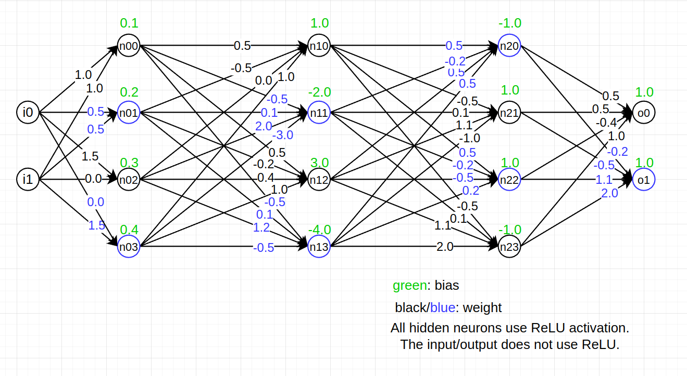

# symexe4dnn

## How to run
navigate to ```./src``` directory, and run the following:
```
python se.py <input>
```
Currently, we have a couple hardcoded input under ```./example```.

## Examples
1.   
    ```
    python se.py ../example/toy/4x3_1.py
    ```
    This is a toy DNN example that has 4 inputs, 3hidden layers, and 4 neurons at each layer (12 ReLU neurons). SE is able to scale on these kind of small networks.
    
    <details>
    
     <br/>

    <summary>Sample in/output</summary>

    ```
    $ python se.py ../example/toy/4x3_1.py

    =========SE started=========
    layer: 0
            inputs: ['i0', 'i1']
    layer: 1
            inputs: ['n00', 'n01', 'n02', 'n03']
    layer: 2
            inputs: ['n10', 'n11', 'n12', 'n13']
    layer: 3
            inputs: ['n20', 'n21', 'n22', 'n23']
    ============================
    DONE:
    2       inputs
    4       layers
    2       outputs
    time used: 
    0.007296120000319206 s
    symbolic states obtained
    And(n00 ==
        If(1*i0 + 1*i1 + 1/10 <= 0, 0, 1*i0 + 1*i1 + 1/10),
        n01 ==
        If(1/2*i0 + 1/2*i1 + 1/5 <= 0, 0, 1/2*i0 + 1/2*i1 + 1/5),
        n02 ==
        If(3/2*i0 + 0*i1 + 3/10 <= 0, 0, 3/2*i0 + 0*i1 + 3/10),
        n03 ==
        If(0*i0 + 3/2*i1 + 2/5 <= 0, 0, 0*i0 + 3/2*i1 + 2/5),
        n10 ==
        If(1/2*n00 + -1/2*n01 + 0*n02 + 1*n03 + 1 <= 0,
        0,
        1/2*n00 + -1/2*n01 + 0*n02 + 1*n03 + 1),
        n11 ==
        If(-1/2*n00 + 1/10*n01 + 2*n02 + -3*n03 + -2 <= 0,
        0,
        -1/2*n00 + 1/10*n01 + 2*n02 + -3*n03 + -2),
        n12 ==
        If(1/2*n00 + -1/5*n01 + 2/5*n02 + 1*n03 + 3 <= 0,
        0,
        1/2*n00 + -1/5*n01 + 2/5*n02 + 1*n03 + 3),
        n13 ==
        If(-1/2*n00 + 1/10*n01 + 6/5*n02 + -1/2*n03 + -4 <= 0,
        0,
        -1/2*n00 + 1/10*n01 + 6/5*n02 + -1/2*n03 + -4),
        n20 ==
        If(1/2*n10 + -1/5*n11 + 1/2*n12 + 1/2*n13 + -1 <= 0,
        0,
        1/2*n10 + -1/5*n11 + 1/2*n12 + 1/2*n13 + -1),
        n21 ==
        If(-1/2*n10 + 1/10*n11 + 11/10*n12 + -1*n13 + 1 <= 0,
        0,
        -1/2*n10 + 1/10*n11 + 11/10*n12 + -1*n13 + 1),
        n22 ==
        If(1/2*n10 + -1/5*n11 + -1/2*n12 + 1/5*n13 + 1 <= 0,
        0,
        1/2*n10 + -1/5*n11 + -1/2*n12 + 1/5*n13 + 1),
        n23 ==
        If(-1/2*n10 + 1/10*n11 + 11/10*n12 + 2*n13 + -1 <= 0,
        0,
        -1/2*n10 + 1/10*n11 + 11/10*n12 + 2*n13 + -1),
        o0 == 1/2*n20 + 1/2*n21 + -2/5*n22 + 1*n23 + 1,
        o1 == -1/5*n20 + -1/2*n21 + 11/10*n22 + 2*n23 + 1)

    =========SE finished=========
    ```
    </details>
2. 
    ```
    python se.py ../example/acasxu/acasxu_1.py
    ```
    This is a DNN taken from the ACASXU flight navigation benchmark. This network has 5 in/outputs and 6 hidden layers each with 50 ReLU neurons (300 ReLu neurons). We are able to generate the symbolic state of this network, but the symbolic state is too large for the solver(z3) to solve.


## dependencies
- z3-solver

If you want to try the ACASXU example, you will need the following packages 
- onnx
- onnx2pytorch
- torch

A conda envs is provided: ```envs.yaml```
